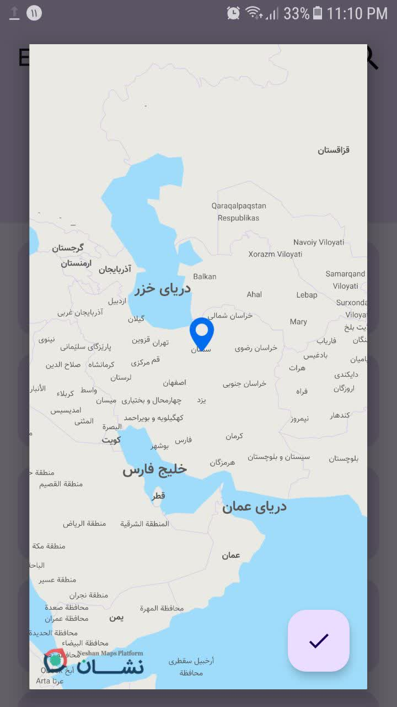
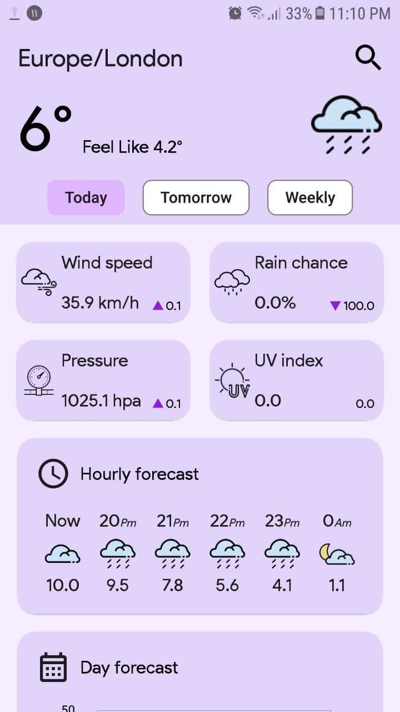
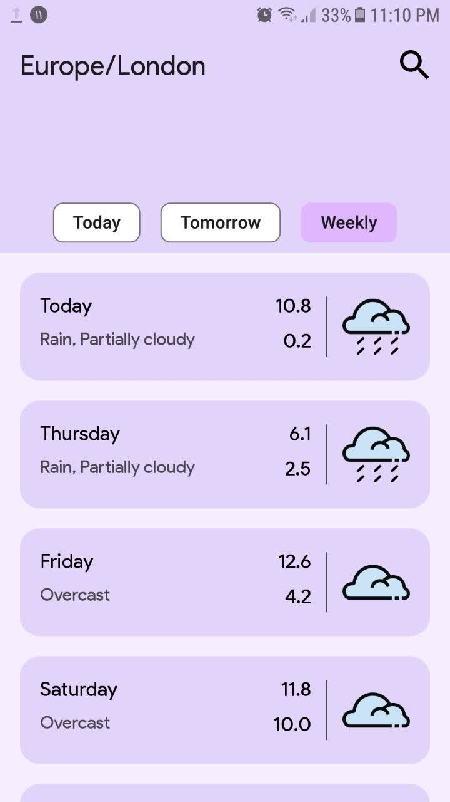

<!-- PROJECT SHIELDS -->
<!--
*** I'm using markdown "reference style" links for readability.
*** Reference links are enclosed in brackets [ ] instead of parentheses ( ).
*** See the bottom of this document for the declaration of the reference variables
*** for contributors-url, forks-url, etc. This is an optional, concise syntax you may use.
*** https://www.markdownguide.org/basic-syntax/#reference-style-links
-->

[![MIT License][license-shield]][license-url]
[![LinkedIn][linkedin-shield]][linkedin-url]

<!-- PROJECT LOGO -->
 

  

  <h3 align="center">myForecast</h3>

  

    check the weather data and update your information about the weather around yourself.
     
     
    <a href="https://screenpal.com/watch/cZV2jXVJ1Gj">View Demo</a>
    ·
    <a href="https://github.com/mahdihassani-dev/SimpleNoteApp/issues">Report Bug</a>
    ·
    <a href="https://github.com/mahdihassani-dev/SimpleNoteApp/issues">Request Feature</a>
  

<h3 align="center">Screenshots :camera:</h3>

  <table>
    <tr>
      <td align="center">
        
      </td>
      <td align="center">
        
      </td>
      <td align="center">
        
      </td>
      <td align="center">
        
      </td>
    </tr>
  </table>

## Technologies I used
#### Material Design System:
[![Product Name Screen Shot][materialDesign-pic]](https://m3.material.io/)
 
a popular desigin system which give you a pleasant and simple design with beautiful components. 
 
#### Retrofit:
[![Product Name Screen Shot][retrofit-pic]](https://square.github.io/retrofit/)
 
Retrofit library help android developer to communicate with apis and server and it make transfering data between client(moblie app) and server really easy and pleasant.
 
#### MVVM Architecture:
[![Product Name Screen Shot][mvvm-pic]]()
 
#### The separate code layers of MVVM are:
Model:This layer is responsible for the abstraction of the data sources. Model and ViewModel work together to get and save the data.
  
View: The purpose of this layer is to inform the ViewModel about the user’s action. This layer observes the ViewModel and does not contain any kind of application logic.
  
ViewModel: It exposes those data streams which are relevant to the View. Moreover, it serves as a link between the Model and the View.
 
#### Asynchronous progrmming:
[![Product Name Screen Shot][asynchronous-pic]]()
in main branch I used rxjava to communicate with server asyncronously but i thougt to rewrite it with kotlin coroutines, so I made another branch and replace rxjava with coroutines.

## Apis
i got the apis from this repo : "https://www.visualcrossing.com/weather-api"  
the map sdk from this repo : "https://platform.neshan.org/sdk/android-sdk-getting-started/"

 

## Ui
i got the Ui idea from this repo :    "https://www.figma.com/file/aXiD6NU9bqKkttlZ0HuYng/Google-Weather-App-Redesign-(Community)?type=design&node-id=1-46&mode=design&t=7NlnNfe8M2PznYiG-0"

<!-- MARKDOWN LINKS & IMAGES -->
<!-- https://www.markdownguide.org/basic-syntax/#reference-style-links -->
[license-shield]: https://img.shields.io/github/license/othneildrew/Best-README-Template.svg?style=for-the-badge
[license-url]: https://github.com/mahdihassani-dev/SimpleNoteApp/blob/main/LICENSE
[linkedin-shield]: https://img.shields.io/badge/-LinkedIn-black.svg?style=for-the-badge&logo=linkedin&colorB=555
[linkedin-url]: https://www.linkedin.com/in/mahdi-hassani-939602255/
[materialDesign-pic]: images/materialDesign.png
[retrofit-pic]: images/retrofit.png
[mvvm-pic]: images/mvvm.png
[asynchronous-pic]: images/asynchronous.jpg
